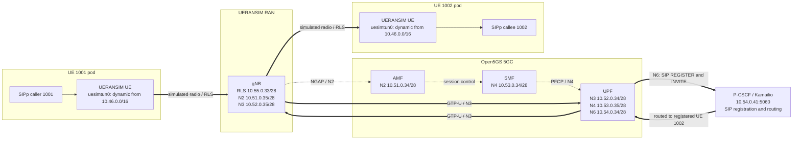

# Open5GS two-UE simulated VoNR

This Helm chart deploys an Open5GS standalone 5G core, one UERANSIM gNB,
two separately provisioned UERANSIM UEs (`1001` and `1002`), SIPp endpoints,
and a small Kamailio registration/routing proxy. The core and simulator are
adapted from `infinitydon/telco-helm-charts/open5gs-5g`; the Kamailio image is
built on the OAM VM from `herlesupreeth/docker_open5gs` commit
`7464234a9f79718df1836d24d688be745a5272d1`.

This is a repeatable VoNR signaling simulation, not a production IMS. Both
UEs establish 5G PDU sessions, register SIP contacts through those tunnels,
and complete an INVITE/180/200/ACK/BYE dialog through the N6-side proxy. SDP
offers PCMU, but the acceptance test does not generate or measure RTP media.

## Address plan

Every Multus network consumes a non-overlapping `/28` carved from an existing
lab `/24`. The UE DNN address pool remains a `/16`:

| Network | Subnet |
| --- | --- |
| N2 | `10.51.0.32/28` |
| N3 | `10.52.0.32/28` |
| N4 | `10.53.0.32/28` |
| N6 / SIP proxy | `10.54.0.32/28` |
| UERANSIM radio simulation | `10.55.0.32/28` |
| UE DNN pool | `10.46.0.0/16` |

## End-to-end network flow



The dashed links are control-plane signaling. The solid links show the user-
plane SIP path exercised by the acceptance call. SIPp shares each UE pod's
network namespace, so its packets enter and leave through `uesimtun0` rather
than bypassing the simulated 5G PDU session.

All container images have explicit, immutable version tags; `latest` is not
used. The GHCR images are private, so create the referenced pull secret before
installing (never commit the token):

Dockerfiles and OAM build commands for the two custom images are kept in
`container-images/`. Helm ignores that directory through `.helmignore`, so the
Docker build contexts are versioned in Git but omitted from chart packages.

```bash
kubectl create namespace vonr
kubectl -n vonr create secret docker-registry ghcr \
  --docker-server=ghcr.io --docker-username=YOUR_GITHUB_USER \
  --docker-password="$GITHUB_TOKEN"
```

## Install from the OAM VM

```bash
export KUBECONFIG=/home/ubuntu/kubeconfig
cd /home/ubuntu/work/telco-helm-charts
helm lint ./open5gs-vonr
helm upgrade --install vonr ./open5gs-vonr -n vonr --create-namespace \
  --set 'imagePullSecrets[0].name=ghcr' --wait --timeout 15m
./open5gs-vonr/scripts/test.sh
```

The workloads are pinned to MicroK8s workers because the Multus macvlan
master (`enp6s19`) exists there. The acceptance script also rejects omitted
image tags and `latest`, waits for the deployments, confirms both PDU sessions,
registers both SIP users, and places one call from `1001` to `1002`.

## Validated call evidence

The following excerpt was captured by `scripts/test.sh` from release `vonr`,
revision 15, on 2026-08-17. The UE tunnel addresses are assigned dynamically and
may differ on a later deployment.

```text
deployment "vonr-open5gs-vonr-ue1" successfully rolled out
deployment "vonr-open5gs-vonr-ue2" successfully rolled out
deployment "vonr-open5gs-vonr-pcscf" successfully rolled out
UE 1001 tunnel: 10.46.0.2; UE 1002 tunnel: 10.46.0.3; P-CSCF: 10.54.0.41

REGISTER ---------->  1
     200 <----------  1
Successful call       1
Failed call           0

REGISTER ---------->  1
     200 <----------  1
Successful call       1
Failed call           0

  INVITE ---------->  1
     100 <----------  1
     180 <----------  1
     200 <----------  1
     ACK ---------->  1
   Pause [5000ms]     1
     BYE ---------->  1
     200 <----------  1
Successful call       1
Failed call           0

PASS: 1001 completed the simulated VoNR SIP dialog with 1002 through both 5G PDU sessions.
```

The UERANSIM containers also reported the prerequisite 5G session state for
both subscribers:

```text
[ue1] Registration is successful
[ue1] PDU Session establishment is successful
[ue2] Registration is successful
[ue2] PDU Session establishment is successful
```

Together these lines demonstrate 5G registration and PDU-session setup for
both UEs, SIP registration through the N6 proxy, and successful establishment
and teardown of the simulated voice dialog. They do not demonstrate RTP packet
generation; the test negotiates PCMU in SDP but validates signaling only.

### P-CSCF / Kamailio logs

The P-CSCF in this chart is the Kamailio container built from the pinned
`docker_open5gs` source. It listens on the N6 attachment and logs SIP routing
events. The same successful acceptance run produced:

```text
Listening on
             udp: 10.54.0.41:5060
Aliases:
             *: ims.mnc001.mcc001.3gppnetwork.org:*

VoNR P-CSCF received REGISTER
VoNR P-CSCF stored registered contact and returned 200
VoNR P-CSCF received REGISTER
VoNR P-CSCF stored registered contact and returned 200
VoNR P-CSCF received INVITE and selected registered callee
VoNR P-CSCF relaying request to registered contact
VoNR P-CSCF relaying request to registered contact
VoNR P-CSCF relaying request to registered contact
```

Retrieve the live evidence with:

```bash
kubectl -n vonr logs deploy/vonr-open5gs-vonr-pcscf -c pcscf | \
  grep -E 'Listening on|udp:|Aliases:|VoNR P-CSCF'
```
